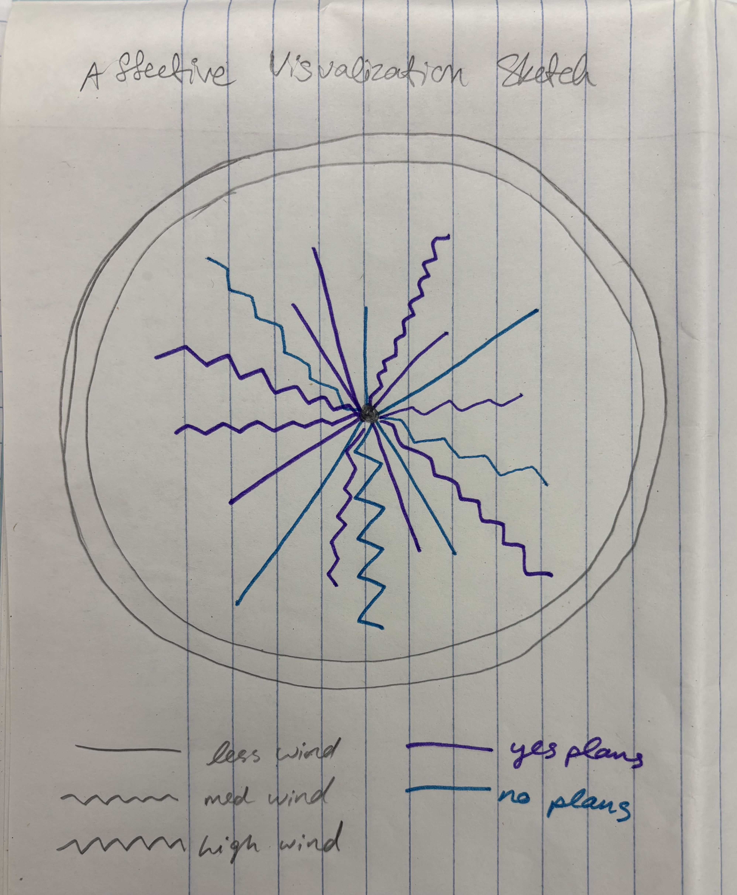
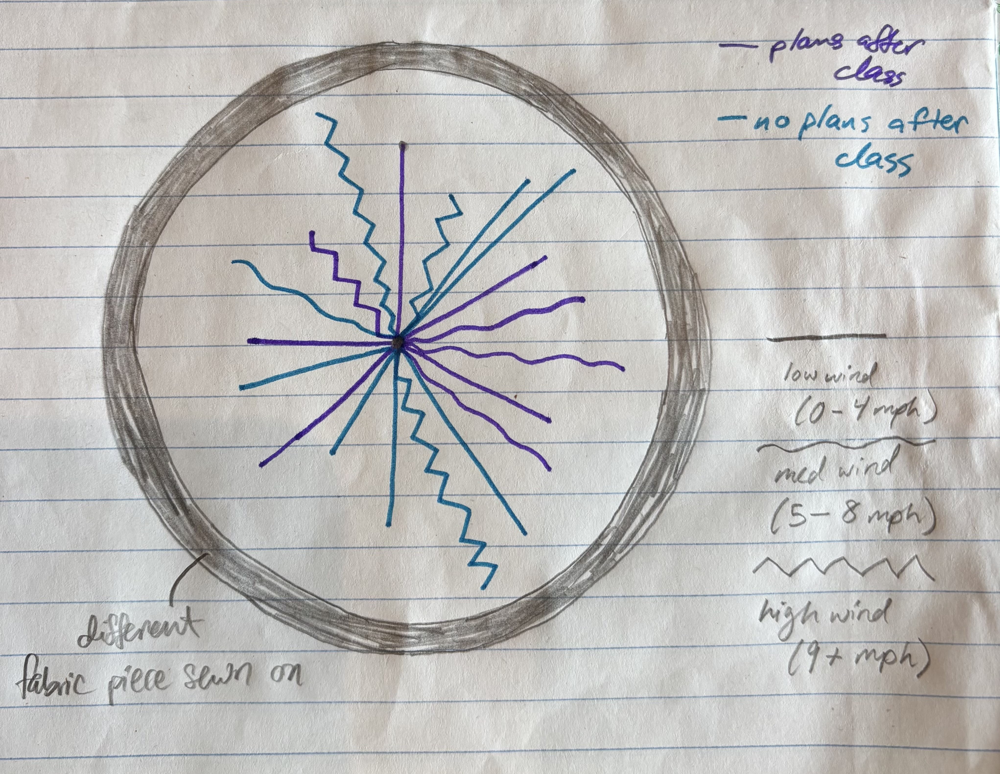

# Part 1: Set up 

```{r}
#| label: set-up

# reading in packages 
library(tidyverse)
library(janitor)
library(here)
library(readxl)

# reading in data
# kelp data
kelp <- read.csv(
  here("data", "temp-kelp.csv"))
# personal data 
bike_rides <- read_xlsx(
  here("data", "bike-rides.xlsx"))
```

# Part 2: Problems 

## Problem 1 

a. Pearson's correlation and Spearman rank correlation are two tests that determine the strength of the relationship between temperature and giant kelp frond elongation rate. Pearson's correlation requires continuous, normally distributed variables with a linear relationship, while Spearman rank correlation does not require normally distributed variables. 

b. 
```{r}
#| label: visualization # ADD COLOR

# base layer ggplot
ggplot(data = kelp, 
       mapping = aes(x = temp_c, # x axis is temp
                     y = kelp_elong)) + # y axis is kelp growth rate
  # first layer: points
  geom_point(color = "#D6364F", # custom color
             shape = 15) + # make points square
  # rename axes, add units
  labs(x = "Temp (\u00B0C)",
       y = "Kelp elongation rate (cm/day)") + 
  theme_minimal() # custom theme
```

c. 
### Check assumptions 
```{r}
#| label: check-assumptions

# base layer: ggplot
ggplot(data = kelp, # starting data frame
aes(sample = kelp_elong)) + # y-axis for QQ plot
# first layer: QQ reference line
geom_qq_line(color = "red") + # adding a color
# second layer: QQ plot
geom_qq() 
```
I checked the assumption of normality by creating a QQ plot. No curved pattern in the data is evident on the plt, meaning the data is approximately normally distributed. 

### Run the test
```{r}
#| label: pearsons-correlation

# run pearson's correlation test 
cor.test(kelp$kelp_elong, kelp$temp_c, # specify variables within data frame
         method = "pearson")
```

d. I used a Pearson's correlation test to evaluate the strength of the relationship between temperature and giant kelp frond elongation rate because the data is continuous, normally distributed, and has a linear relationship. 

We found a moderate negative relationship between temperature and giant kelp frond elongation rate (Pearson's r = -0.69, t(30) = -5.2, p < 0.001, $\alpha$ = 0.05). As temperature increases, giant kelp frond elongation rate decreases. 

e. Lower temperatures are conducive for increased giant kelp growth rates

## Problem 2

a. 
```{r}
#| label: continuous-predictor-visual

# cleaning data
wind_speed_and_duration <- bike_rides |> # create new object from rides
   clean_names() |> # clean column names
  # select wind speed and duration columns
  select(wind_speed_mph, duration_seconds)

# plot the data, base layer ggplot
ggplot(data = wind_speed_and_duration,
       # assign x as wind speed, y as ride duration
       mapping = aes(x = wind_speed_mph,
                     y = duration_seconds,
                     color = "wind_speed_and_duration")) + # add color
  # first layer: points
  geom_point() +
  # manually assign colors
  scale_color_manual(values = c("wind_speed_and_duration" = "darkblue")) + 
    # rename x and y axes, add descriptive title and subtitle
  labs(title = "Wind speed and bike ride duration",
       subtitle = "05/26/26",
       x = "Wind speed (mph)",
       y = "Bike ride duration (seconds)") +
  theme_classic() + # custom theme
  # taking out legend
  theme(legend.position = "none")
```

```{r}
#| label: categorical-predictor-visual

# cleaning data
plans_and_duration <- bike_rides |> # create new object from rides
   clean_names() |> # clean column names
  # select plans and duration columns
  select(plans_after_class, duration_seconds)

# create new object from plans_and_duration
plans_and_duration_summary <- plans_and_duration |> 
  group_by(plans_after_class) |> 
  summarize( # what I want in the summary
    mean = mean(duration_seconds),
    n = length(duration_seconds),
    sd = sd(duration_seconds)) 

plans_and_duration_summary # display summary

# base layer ggplot
ggplot(data = plans_and_duration,
       # x-axis should be plans after class
       mapping = aes(x = plans_after_class,
                     y = duration_seconds, # y-axis is ride duration
                     color = plans_after_class)) + # color by plans status
  # first layer: showing the underlying data
  geom_jitter(height = 0, # no jitter in the vertical direction
              width = 0.2, # smaller jitter in the horizontal direction
              alpha = 0.6) + # make the points more transparent
  # second layer: represent means at each site
  stat_summary(geom = "point",
               fun = mean,
               size = 3) + # make point bigger
  # third layer: bars to represent standard deviation
  geom_errorbar(data = plans_and_duration_summary, # use summary data frame
                mapping = aes(x = plans_after_class,
                              y = mean, # assign axes based on data frame
                              ymin = mean - sd,
                              ymax = mean + sd),
                width = 0.1) + # make the bars narrower
  # relabelling x- and y-axes, adding descriptive title and subtitle
  labs(title = "Bike ride duration depending on plans after class",
       subtitle = "05/26/26",
       x = "Plans after class",
       y = "Mean and SD ride duration (seconds)") + 
  theme_light() + # custom theme
  scale_color_manual(values = c("yes" = "purple", # custom colors
                                "no" = "pink2"))
```

b. Figure 1 (continuous): Possible effect of wind speed on my bike ride duration. Blue points represent individual bike rides. Data was manually recorded. 

Figure 2 (categorical): Mean bike ride duration is slightly higher when I don't have plans after class. Small transparent points represent individual bike rides (purple: plans after class, pink: no plans after class). Larger opaque points represent the means. Bars represent one standard deviation from the mean. Data was manually recorded. 

## Problem 3 

a. For my data, an affective visualization could look like an artistic representation of my bike ride length, arranged to look like a bike wheel. I could do this with embroidery thread on a piece of fabric. The threads of different lengths would all be coming from the center of the wheel, sprawling outwards. I could use different colors of thread to represent whether I had plans after class or not and could do different stitches to reflect the wind speed of each bike ride. 

b. 

c. 

d. My work shows my bike ride durations from the campus bike racks to my home, as well as whether I had plans after class and the wind speed. Stefanie Posavec and Giorgia Lupi’s Dear Data project influenced my work. I liked how they used a variety of shapes, colors, and line types. I wanted my work to resemble a bike in some way, and their designs inspired me to make my piece in the shape of a bike wheel. My work is an embroidered piece on a fabric backing, made of only fabric and embroidery thread. To create my work, I first chose my key for colors and shapes. Next, I converted my bike ride durations into physical lengths in centimeters and marked the ending points on my fabric for each bike ride. I then stitched each bike ride onto the fabric in its corresponding color and shape.

e. [My slides](https://docs.google.com/presentation/d/1U3bIobSCt50VyuEkxFTHpYLOhekoFjYayGJpzDQgLgc/edit?usp=sharing)

## Problem 4 

a. 


